# RNA-seq Analysis: GPER Agonist (G1) Treatment in MCF-7 Breast Cancer Cells

Differential gene expression and functional enrichment analysis of RNA-seq data from MCF-7 breast cancer cells treated with G1, a selective agonist of the G-protein coupled estrogen receptor (GPER/GPER1), at two doses (100 nM and 1 µM) vs vehicle control.

**Dataset:** [GSE188706](https://www.ncbi.nlm.nih.gov/geo/query/acc.cgi?acc=GSE188706) (SRA: SRP345788), Homo sapiens, MCF-7 cell line, paired-end Illumina HiSeq X Ten, n=3 per group.


## Key Findings

- **1 µM (Higher dose):** Triggers a massive, reliable response. Hundreds of genes shift significantly, meaning GPER activation requires crossing a specific concentration threshold to actually remodel transcription.
- **100 nM (Low dose):** Barely scratches the surface. While there is a slight shift in ~260 genes before correction, none pass strict statistical significance (padj < 0.05).
- **Downregulated genes (1 µM)** Genes that went down at 1uM are mostly related to cell division and DNA repair - things like TOP2A, BRCA2, BUB1B. GO enrichment backs this up strongly across all three categories (process, location, function), with hundreds of genes involved and very low FDR values.
- **Upregulated genes (1 µM)** Genes that went up at 1uM split into two groups: one linked to a stress/p53 pathway (CDKN1A, GADD45A, BAX), and another linked to skin/epithelial structural genes (KRT7, KRT16, and other keratins) and basement membrane genes.
- Together, this is a growth-arrest / senescence-like signature: cell-cycle machinery shut down, stress-arrest and differentiation programs activated.

## GO enrichment - Downregulated genes (1uM vs Control)

### GO Biological Process
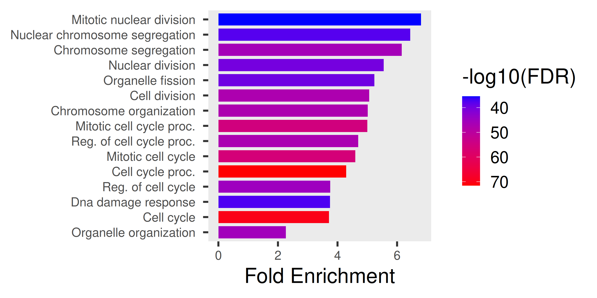

### GO Molecular Function
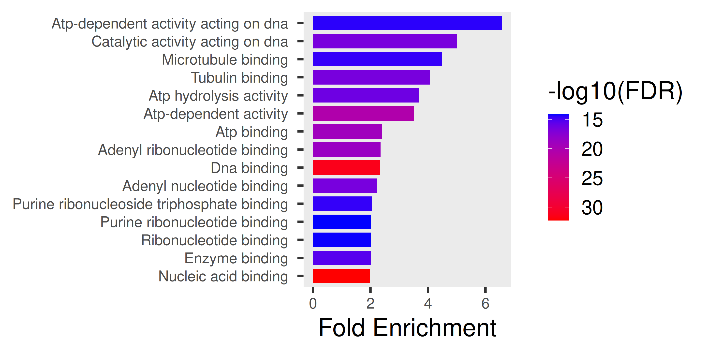

### GO Cellular Component
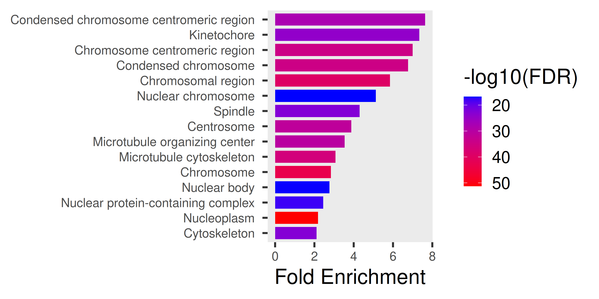

## GO enrichment - Upregulated genes (1uM vs Control)

### GO Biological Process
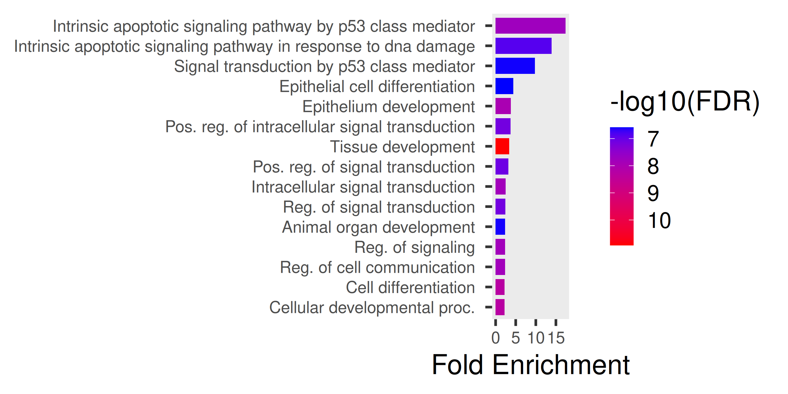

### GO Molecular Function
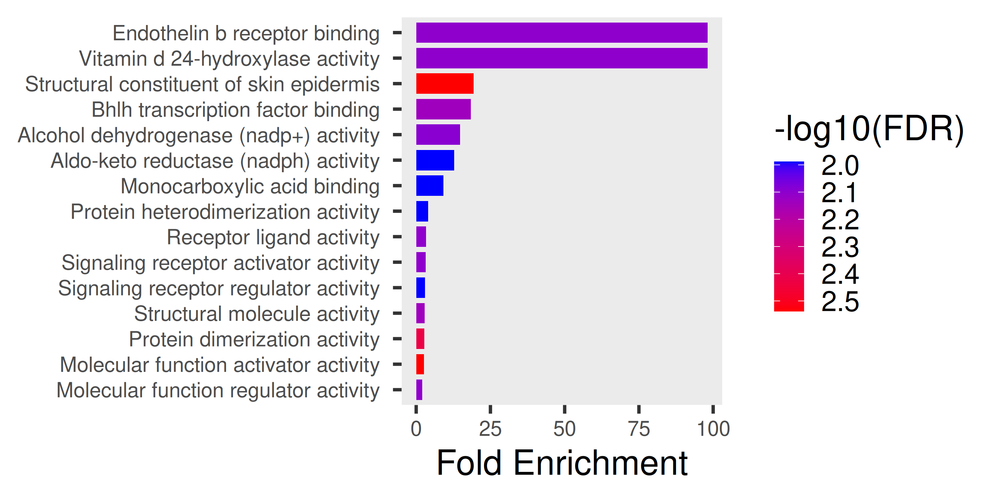

### GO Cellular Component
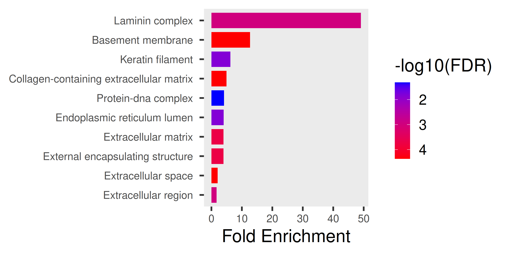

## Volcano Plots & Network Analysis

### Volcano plot 1uM
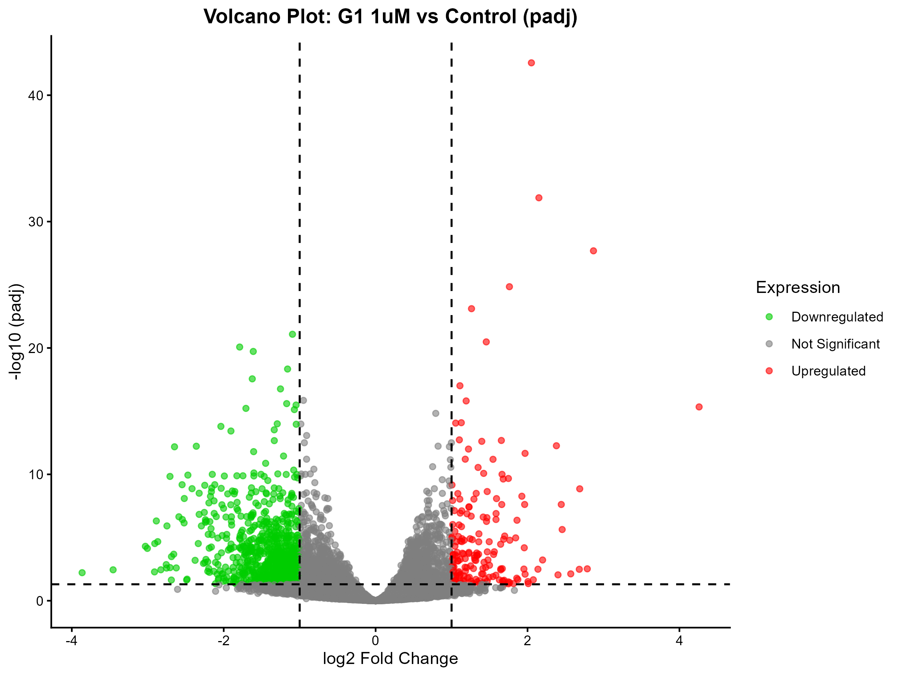

### Volcano plot 100nM
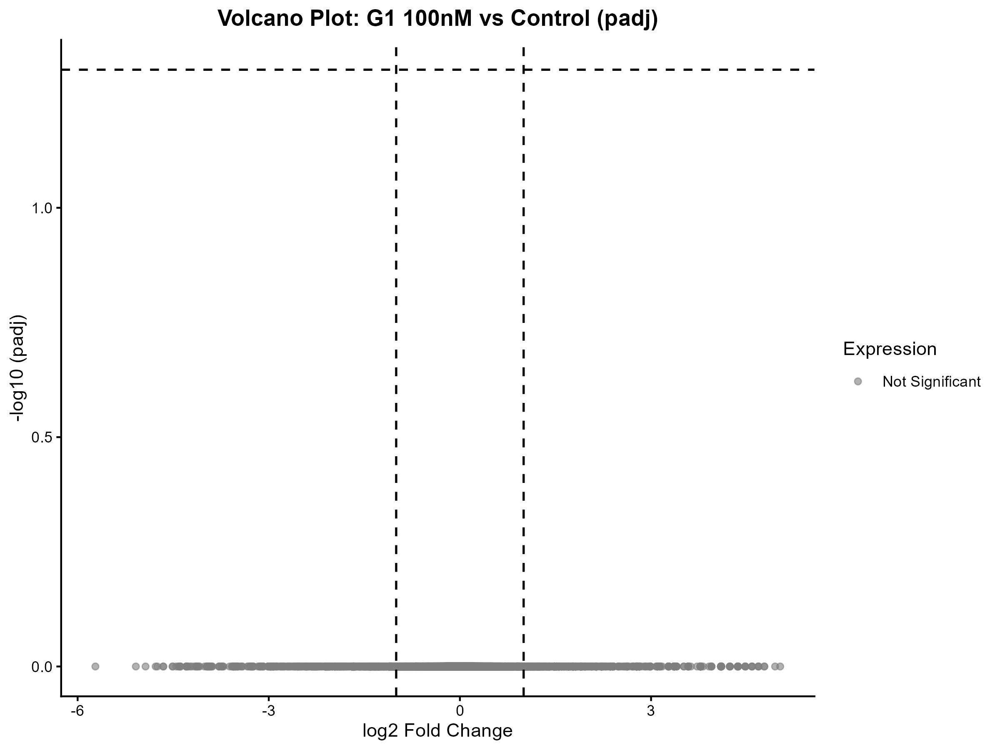

### Downregulated STRING network
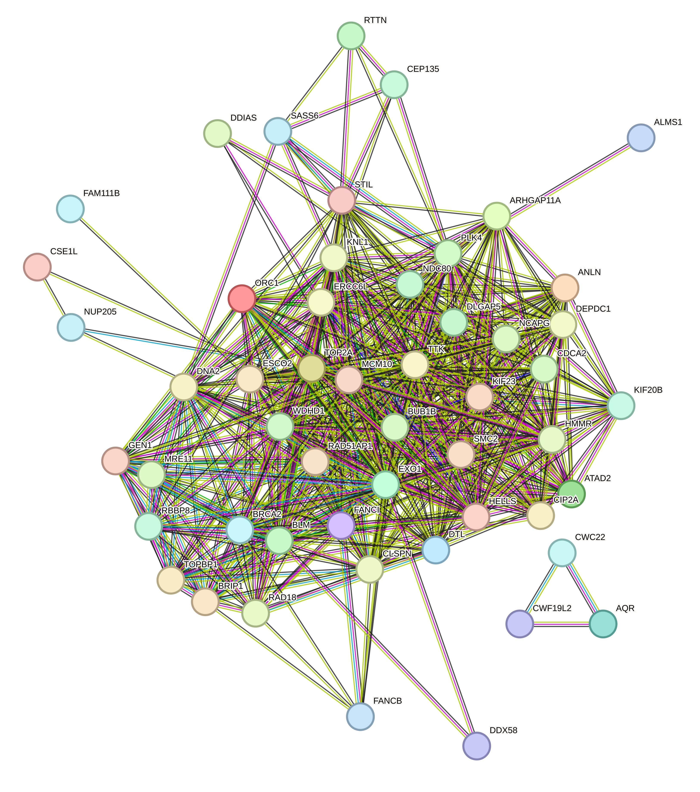

Upregulated STRING network
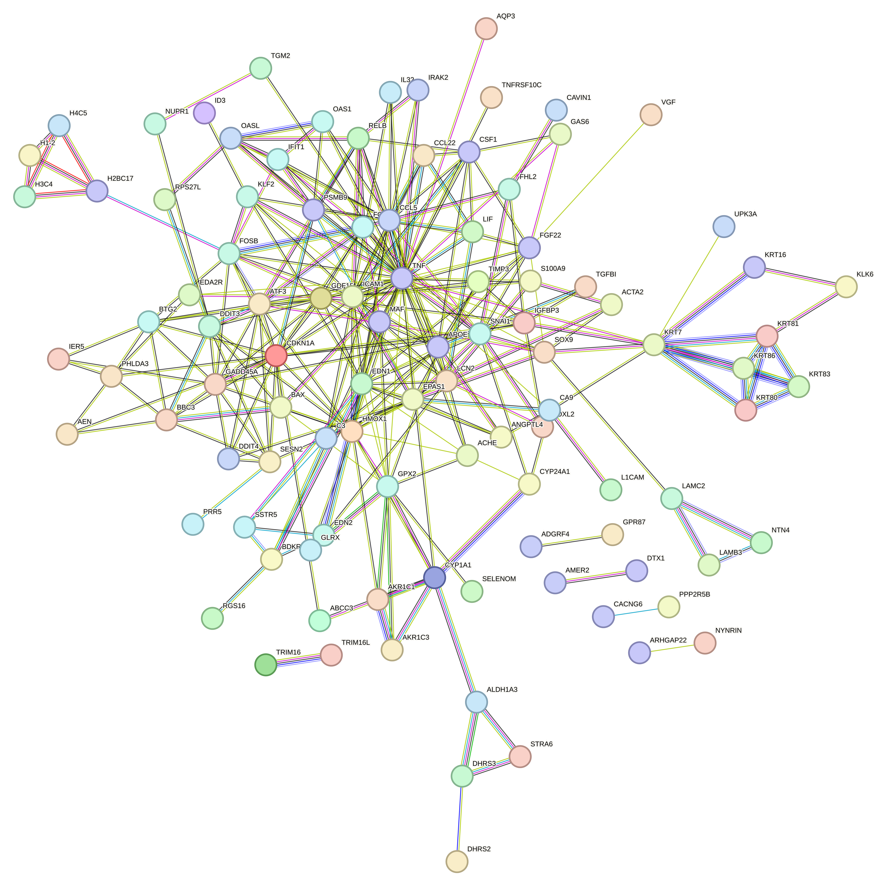


## Pipeline workflow
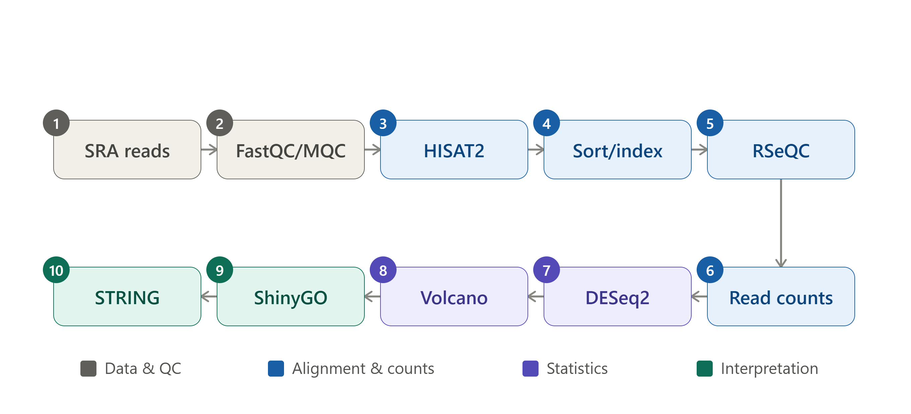


## Tools I used:

```
- SRA Toolkit (prefetch, fasterq-dump) - downloading raw data
- FastQC / MultiQC - quality checking reads
- HISAT2 - aligning reads to the genome
- samtools - sorting/indexing BAM files
- RSeQC - checking if the library was stranded or not
- featureCounts (Subread) - counting reads per gene
- DESeq2 (R) - differential expression
- ShinyGO - GO enrichment
- STRING - protein-protein interaction networks
```


## Reproducing the Analysis

```
# set up the environment
conda env create -f environment_minimal.yml
conda activate rnaseq

# run the pipeline in order
bash scripts/01_download_qc.sh
bash scripts/02_alignment.sh
bash scripts/03_strandedness_check.sh
bash scripts/04_quantification.sh
Rscript scripts/05_DESeq2_script.R
Rscript scripts/06_VOLCANO_PLOT__GGPLOT2__1uMvsControl.R
Rscript scripts/07_VOLCANO_PLOT__GGPLOT2__100nMvsControl.R
```

## Note: 
- The R scripts have setwd("D:/Project/RNA_Seq/...") at the top - change this path to wherever you put the project on your computer before running.

- I didn't include the raw FASTQ files, reference genome, or BAM files in this repo since they're too big for GitHub. You can get them again using the SRA accession (SRP345788) and the download links in scripts/01_download_qc.sh and scripts/02_alignment.sh.

- Adapter content showed a "warn" flag (not "fail") in 12 of 18 files, while per-base sequence quality was clean throughout. I decided to skip a separatetrimming step since HISAT2 performs soft-clipping by default it can align the clean portion of a read and clip off contaminated ends during alignment,  rather than needing adapters removed beforehand. This handles mild contamination reasonably well, though it's not fully equivalent to trimming, and I'm documenting this as a deliberate trade-off rather than an oversight. (see plots below).

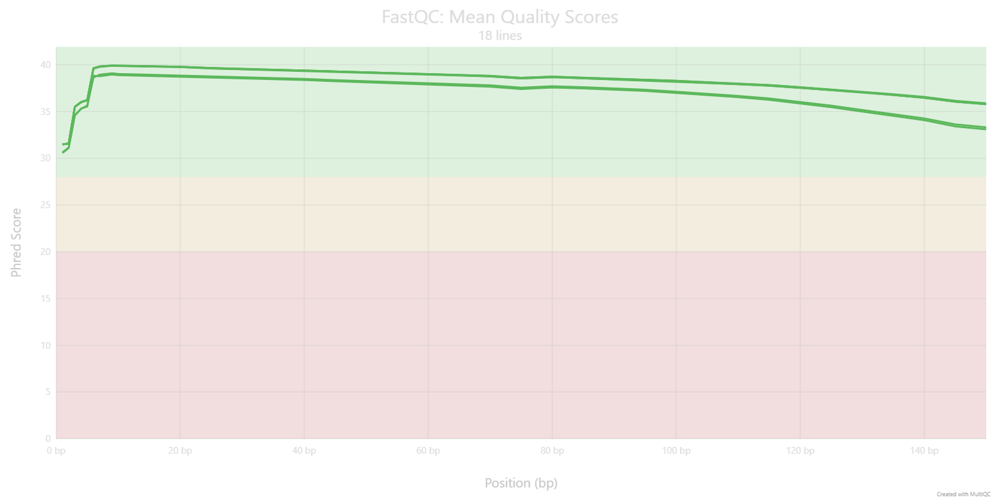
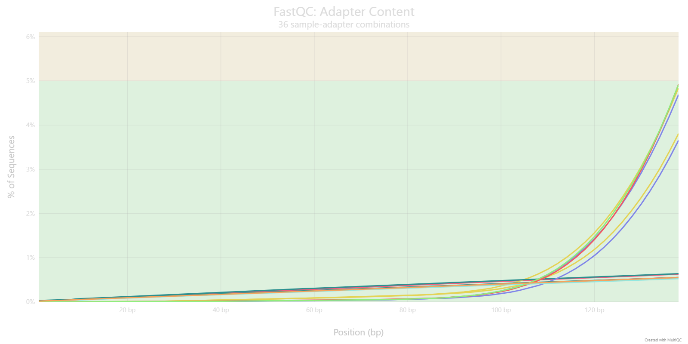

See [methods notes](methods_notes.md) for QC/threshold decisions, and 
[GO biology reference](GO_biology_reference.md) for what the GO terms mean.
